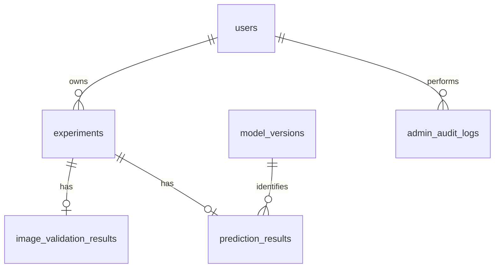

# Database schema

The application uses SQLAlchemy 2.x and SQLite by default. Set `CATFISH_DATABASE_URL` to a PostgreSQL SQLAlchemy URL when deploying elsewhere. All timestamps are UTC.

| Table | Key columns and constraints | Purpose |
|---|---|---|
| `users` | `id` PK; unique indexed `username`, `email`; `role`, `is_active`, `password_hash` | Accounts. Passwords are Argon2 hashes only. |
| `experiments` | `id` PK; `user_id` FK → users; indexed `submitted_at`, `status` | A single submitted analysis and owner. `image_path` is an optional private storage reference, never binary data. |
| `image_validation_results` | `experiment_id` unique FK → experiments | File/quality/fish validation decision, confidence, label, reason and status. |
| `prediction_results` | `experiment_id` unique FK → experiments; `model_version_id` FK → model_versions | Successful output values, class probabilities and model association. |
| `model_versions` | `id` PK; unique `identifier` | Documents the supplied model artifact used for a result. |
| `admin_audit_logs` | `admin_user_id` FK → users | Administrative account-status actions and future privileged events. |

The one-to-one constraints on validation and prediction rows prevent duplicate results for one experiment. Foreign keys use cascading deletion for an experiment owner’s experiment records. The application enables SQLite foreign-key enforcement on every SQLite connection.
